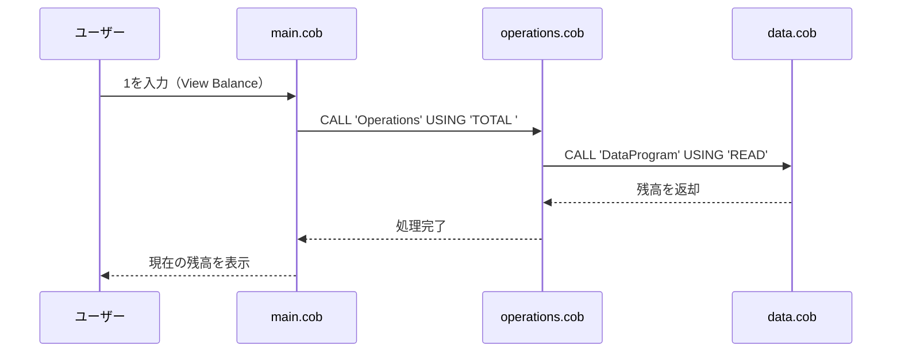
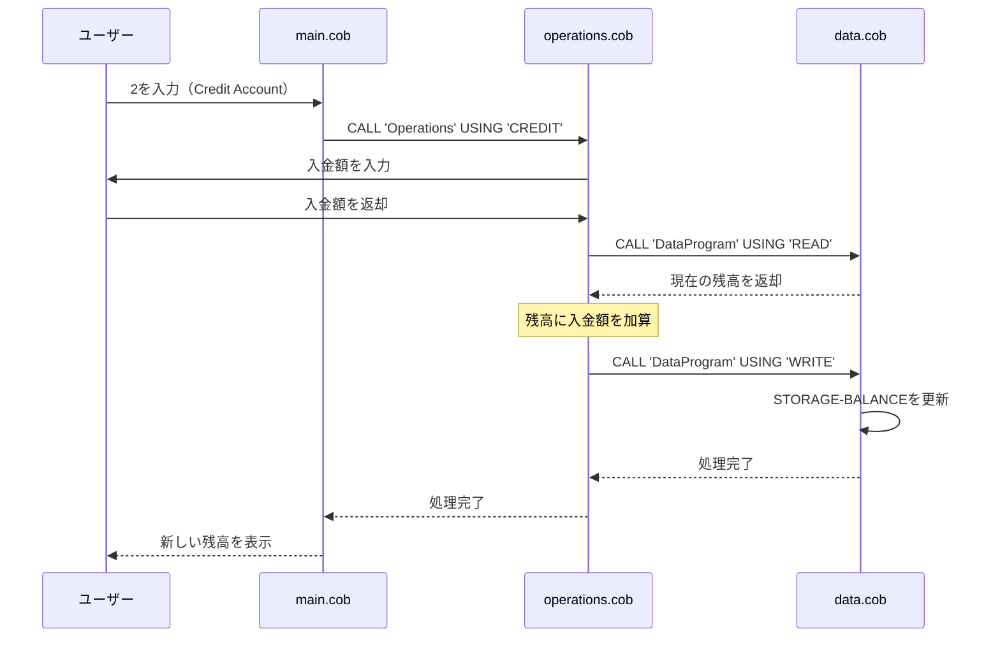
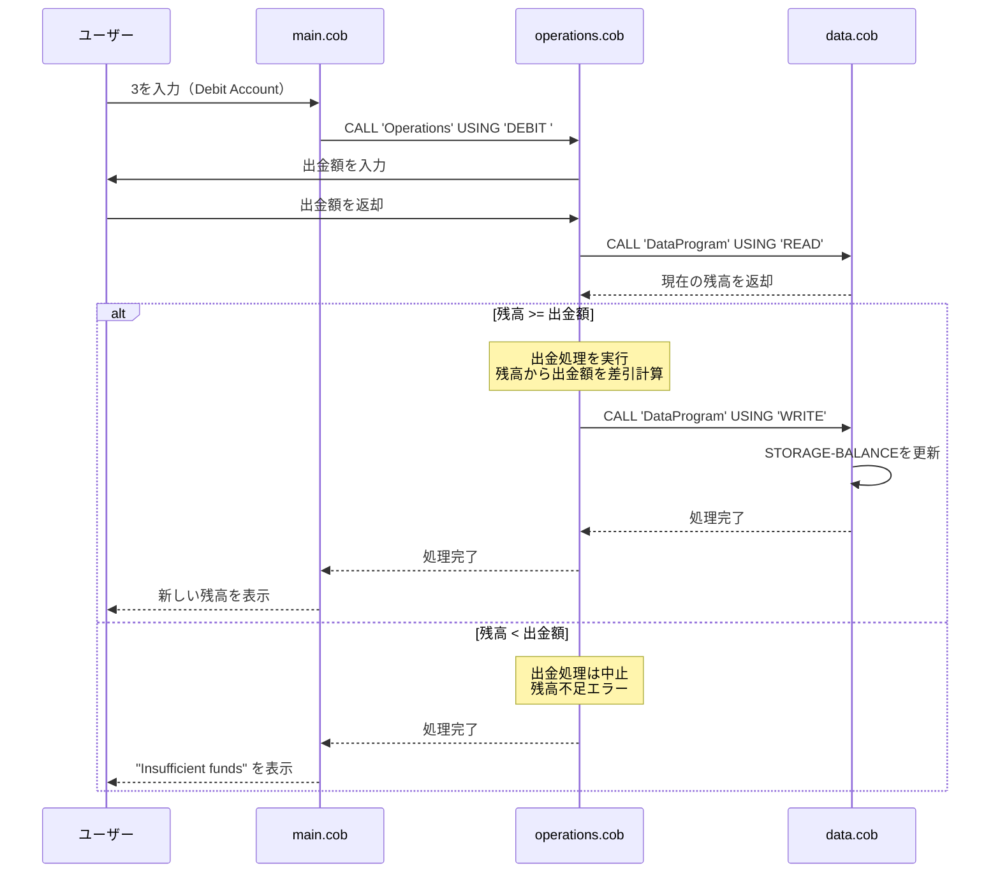
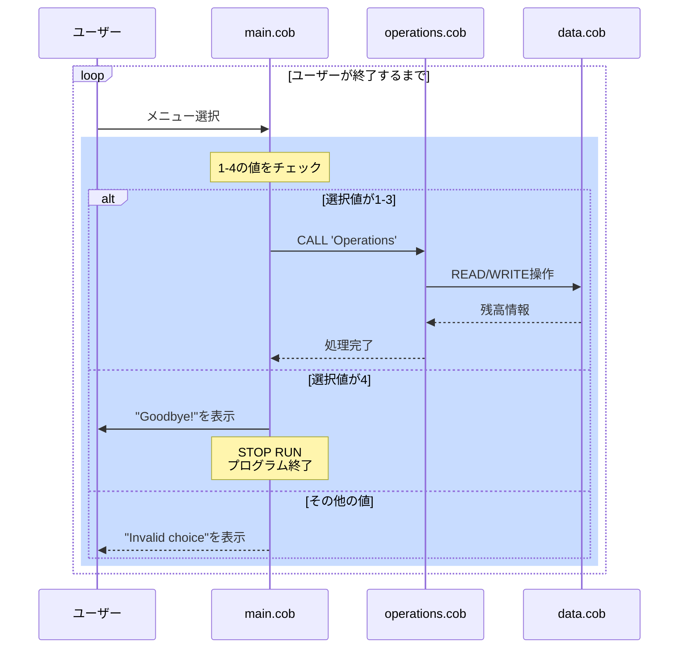

# 学生アカウント管理システム - COBOL プログラムドキュメント

このドキュメントでは、学生アカウント管理システムを構成する各 COBOL プログラムの目的、主要な機能、および業務ルールについて説明します。

## システム概要

このシステムは、学生アカウントの残高管理を行うレガシーシステムです。ユーザーはメニューを通じてアカウント残高の表示、入金、出金の操作を実行できます。

---

## ファイル仕様

### 1. **main.cob** - メインプログラム

#### 目的
ユーザーインターフェースとして機能し、学生アカウント管理システムのエントリーポイントです。ユーザーが選択できるメニューを表示し、入力に基づいて適切な操作を実行します。

#### 主要な機能
- **インタラクティブメニュー表示**：システムで利用可能な4つのオプションを表示します
  1. 残高表示（View Balance）
  2. 入金処理（Credit Account）
  3. 出金処理（Debit Account）
  4. プログラム終了（Exit）

- **ユーザー入力の処理**：ユーザーが選択した操作に対応するプログラムを呼び出します
- **ループ処理**：ユーザーが終了を選択するまで、メニューを繰り返し表示します

#### 学生アカウント関連の業務ルール
- システムは `CONTINUE-FLAG` で終了制御を行い、ユーザーが「4. Exit」を選択するまで実行を続けます
- メニュー選択以外の値（1-4以外）が入力された場合、エラーメッセージを表示して再度メニューを表示します
- すべての操作は Operations プログラムを通じて実行されます

---

### 2. **operations.cob** - 操作プログラム

#### 目的
学生アカウントに対する具体的な操作（残高表示、入金、出金）を実行するビジネスロジックプログラムです。データプログラムとの連携を通じてアカウントデータを管理します。

#### 主要な機能
- **残高表示（TOTAL）**：
  - データプログラムから現在の残高を読み取ります
  - 読み取った残高をユーザーに表示します

- **入金処理（CREDIT）**：
  - ユーザーから入金額を入力として受け付けます
  - 現在の残高を読み取ります
  - 入金額を残高に加算します
  - 更新された残高をデータプログラムに書き込みます
  - 新しい残高をユーザーに表示します

- **出金処理（DEBIT）**：
  - ユーザーから出金額を入力として受け付けます
  - 現在の残高を読み取ります
  - 出金額が残高以下であることを確認します
  - 条件を満たす場合のみ、出金額を残高から差し引きます
  - 更新された残高をデータプログラムに書き込みます
  - 新しい残高をユーザーに表示します

#### 学生アカウント関連の業務ルール

**1. 残高管理**
- アカウント残高の形式：`PIC 9(6)V99`（最大999,999.99の金額を保持）
- 初期残高：1,000.00（学生アカウントの初期値）

**2. 入金ルール（CREDIT）**
- 入金額に上限制限はありません
- 入金後の残高 = 現在の残高 + 入金額
- 入金処理は常に成功します

**3. 出金ルール（DEBIT）**
- 出金前に残高確認を行う必須チェック
- **重要な業務ルール**：出金額が現在の残高以上の場合、出金処理は実行されません
  - 残高不足のメッセージ「Insufficient funds for this debit.」が表示されます
- 出金が成功した場合の残高 = 現在の残高 - 出金額

**4. データ永続化**
- すべての操作後、更新された残高はデータプログラムに書き込まれます
- これにより、次の操作では最新の残高が使用されます

---

### 3. **data.cob** - データプログラム

#### 目的
学生アカウントの残高データを中央で管理し、他のプログラムからの READ（読取）および WRITE（書込）要求を処理するデータ層プログラムです。

#### 主要な機能
- **READ 操作**：
  - 保存されている現在の残高を読み取ります
  - 他のプログラムに残高を返します

- **WRITE 操作**：
  - 受け取った残高をストレージに保存します
  - これにより、残高更新が永続化されます

#### 学生アカウント関連の業務ルール

**1. 残高ストレージ**
- `STORAGE-BALANCE`：学生アカウントの残高を保持するメモリ領域
- 初期値：1,000.00（学生アカウント作成時の初期残高）
- データ型：`PIC 9(6)V99`

**2. データアクセス制御**
- **READ操作**：
  - 操作タイプが「READ」の場合、現在の残高を呼び出し元に返します
  - 読取専用操作のため、ストレージの値は変更されません

- **WRITE操作**：
  - 操作タイプが「WRITE」の場合、受け取った値で`STORAGE-BALANCE`を更新します
  - この操作は入金・出金後の残高更新に使用されます

**3. データ整合性**
- データプログラムが単一の真実の源（STORAGE-BALANCE）となります
- すべての残高操作はこのプログラムを通じて実行されるため、データの一貫性が保証されます

---

## システムフロー

```
┌─────────────┐
│ main.cob    │ ← ユーザーインターフェース
└──────┬──────┘
       │
       ├─── CALL 'Operations' USING 'TOTAL ' ─────┐
       ├─── CALL 'Operations' USING 'CREDIT' ─────┤
       └─── CALL 'Operations' USING 'DEBIT ' ─────┤
                                                    │
                                                    ▼
                                            ┌──────────────┐
                                            │ operations.  │
                                            │ cob          │
                                            │ (ビジネス    │
                                            │  ロジック)   │
                                            └──────┬───────┘
                                                   │
                                 CALL 'DataProgram'│
                                 USING 'READ'/'WRITE'
                                                   │
                                                   ▼
                                            ┌──────────────┐
                                            │ data.cob     │
                                            │ (データ管理) │
                                            └──────────────┘
```

---

## 学生アカウント初期設定

新しい学生アカウントが作成される場合、以下の初期値が設定されます：

| 項目 | 値 |
|------|-----|
| 初期残高 | 1,000.00 |
| 最大残高額 | 999,999.99 |
| 最小出金額 | 0.01 |
| 最大出金額 | 現在の残高 |

---

## 注意事項

1. **レガシーシステム**：このシステムは COBOL で記述されたレガシーコードです。モダナイズを検討する際は、この業務ロール仕様を保持する必要があります。

2. **データ永続性**：現在のシステムはメモリ上の残高のみを保持します。プログラム終了後のデータ永続化が必要な場合は、データベース接続の追加が必要です。

3. **エラーハンドリング**：出金時の残高不足チェックが唯一の重要なバリデーションです。その他のエラーハンドリングは実装されていません。

---

## データフローシーケンス図

### シナリオ1：残高表示（View Balance）



### シナリオ2：入金処理（Credit Account）



### シナリオ3：出金処理（Debit Account）



### 全体的なシステムシーケンス



